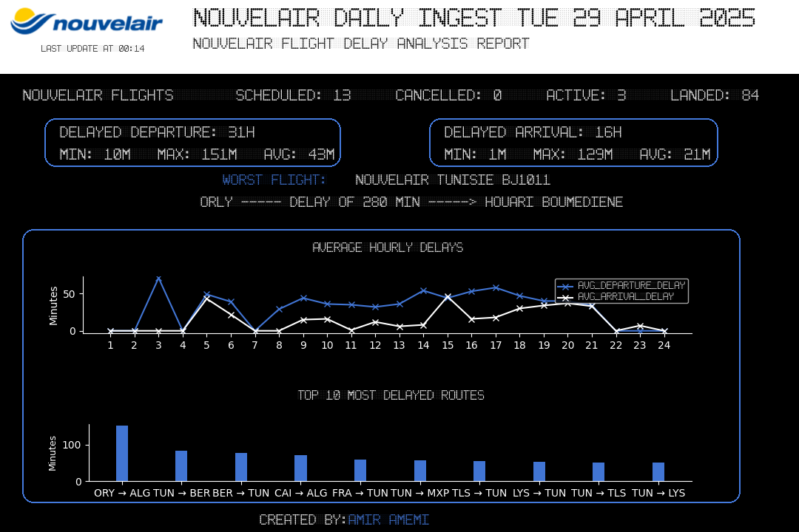

# ✈️ Nouvelair Delay Watch

---

## 🔍 Project Overview

**Nouvelair Delay Watch** is a fully automated system that fetches daily flight data for Nouvelair, cleans and analyzes delays, generates a beautiful custom report, and posts it automatically on Discord (and optionally LinkedIn or other platforms).

Designed to deliver real-time insights about delays, worst flights, and delay distribution by hour and route.

---

## 📅 Daily Report Example

✈️ #Nouvelair Flight Delay Report

📅Date: 2025-04-28
Total Delays :
42 #DelayedDepartures
42 #DelayedArrivals

⚠️Worst Flight:
🛫 Orly  ➡️ Houari Boumediene 🛬 delayed by 129 minutes! 🕒

🌍#Tunisia #Nouvelair #FlightData #AirlinePerformance #DataEngineer #DataAnalyst



---

## 📢 Where to See the Daily Reports?

Join our public Discord server to see the daily published reports:

🔗 **[Join the Discord Server!
](https://discord.gg/n2vmB4Yshk)**

---

## ⚡ Key Features

* 📥 **Data Extraction**: Fetch daily real-time flight data from the [AviationStack API](https://aviationstack.com/).
* 🧹 **Data Cleaning**: Handle missing values, cancellations, and standardize delays.
* 💾 **Flexible Storage**: Choose between saving datasets as CSV files or loading into PostgreSQL databases.
* 📊 **Data Analysis**:
  * Calculate average hourly delays for departures and arrivals.
  * Identify and rank the top 10 most delayed routes.
  * Detect the worst delayed flight of the day.
  * Track status distribution (Scheduled, Landed, Cancelled, Active).
* 📈 **Professional Visualization**:
  * Generate clear line plots, bar charts, and summary cards.
  * Custom-designed black-themed graphical reports.
* 🤖 **Automated Posting**:
  * Discord Webhook (Daily at 10:00 UTC / 12:00 Germany Time).
  * (Optional) LinkedIn Integration for professional updates.
* 🛫 **[Public Discord Server](https://discord.gg/n2vmB4Yshk)** to showcase daily published reports.

---

## 🚲 Technologies Used

<p align="center">
  <br>
  
  
  
  
  
  
  
  

---

## 🛠️ Project Structure

```
nouvelair-delay-watch/
📓 dashboard/           # (Planned) dashboard visualizations
💾 data/                # Daily CSVs and generated reports
📁 notebooks/           # Exploratory Data Analysis (EDA) (Optional)
👁️ src/
    🔀 etl/             # Extract, Transform, Load modules
    📊 analysis/        # Data analytics and visualization
    📢 post/             # Posting utilities (Discord, LinkedIn)
📖 README.md             # Project documentation
🗐 main.py               # Main pipeline script
📃LICENSE               # MIT License file
📒 requirements.txt      # Python dependencies
📆 .github/workflows/    # GitHub Actions (post_daily.yml)
```

---

## 📦 Setup Instructions

### 1. Clone the repository

```
git clone https://github.com/yourusername/nouvelair-delay-watch.git
cd nouvelair-delay-watch
```

### 2. Install dependencies

```
pip install -r requirements.txt
```

### 3. Configure environment variables

Create a `<span>.env</span>` file:

```
API_KEY=your_aviationstack_api_key
POSTGRES_USER = yourpostgres_user
POSTGRES_PASSWORD = your_postgres_password
POSTGRES_HOST = you_postgres_host
POSTGRES_PORT = your_postgres_port
POSTGRES_DB = you_postgres_database
LINKEDIN_API_KEY=your_linkedin_api_key
CLIENT_ID=your_linkedin_client_id
CLIENT_SECRET=your_linkedin_client_secret
PAGE_ID=your_linkedin_page_id
X_API_KEY = your_x_api_key
X_API_SECRET = your_x_api_secret
X_ACCESS_TOKEN = your_x_access_token
X_ACCESS_TOKEN_SECRET = your_x_acceess_token_secret
WEBHOOK_URL=your_discord_webhook_url
```

> **Note**: Sensitive data is securely injected through GitHub Secrets in production.

### 4. Manual Run (Local)

```
python main.py
```

### 5. Automated Run (GitHub Actions)

The `<span>post_daily.yml</span>` is scheduled to run **daily at 10:00 UTC (12:00 Germany Time)** and will automatically:

* Fetch data
* Generate and save the report
* Post it to Discord

---

## 👮️ Security

* API Keys and tokens are never hardcoded.
* Stored securely using GitHub Secrets.

---

## 🙋 Contact Me

* 🔗 [LinkedIn](https://www.linkedin.com/in/amemi-amir/)
* 💼 [Portfolio](https://www.amemi.de)
* 📧 Email: [amir@amemi.de](amir@amemi.de)

Feel free to connect, collaborate, or suggest improvements!

---

## 🌟 Credits

**Project created and maintained by ****[Amir Amemi](https://www.amemi.de)**

Design inspired by real-world flight information displays to maintain an authentic aviation feeling. and Credits to [Skander Boudawara](https://github.com/skanderboudawara) for inspiration and ideas. 

---

## 💎 License

This project is licensed under the **MIT License**.

[
](LICENSE)

---

# ✨ Enjoy Flying with Clean Data! ✨
